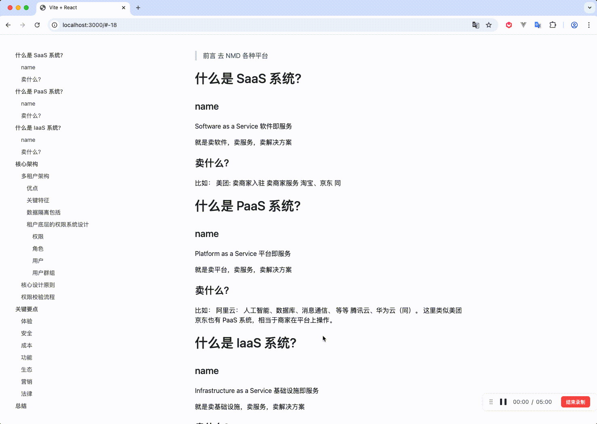

# Markdown Lark Doc 

将 Markdown 文档转换为类飞书文档格式的 HTML 工具


# 使用方式

## 安装

npm i markdown-lark-doc


## 代码示例

```
import { MarkdownLarkDoc } from'markdown-lark-doc';
import index.css from  'markdown-lark-doc/dist/index.css';

const { tocHtml, mdHtml } = transformMarkdown(markdownContent);

// tocHtml 为目录 HTML 代码
// mdHtml 为 Markdown 转换后的 HTML 代码
// 插入到你想放的容器就可以了
```

>   注意：请确保引入 index.css 文件。

## 效果预览


